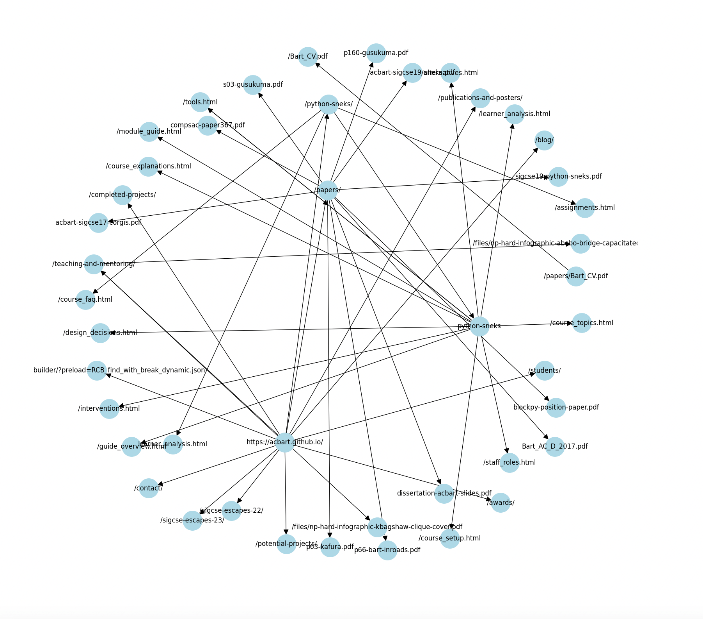

# Internet Networks and Information

**CISC320 Spring 2023 Lesson 14 - Graph Applications**

Group Members:
* Christian Kuhn  (kuhnc@udel.edu)
* Madeline Pearce (mpearce@udel.edu)
* Third member (email)
* Fourth member (email)

The theme of our project is "Internet networks and Information" we will use various graph algorithms to explore our Professor's website pages and subpages!

 
## Installation Code

```sh
$> pip install networkx
$> pip install matplotlib


```

## Python Environment Setup

```python
import networkx as nx
import matplotlib.pyplot as plt

```

# Website Page Traversal
**DFS Page Traversal**: We will explore the entirety of our Professor, Dr.Bart's, website! Given a list of pages as edges, we will create a graph and use a Depth First Search traversal to visit every page on the website.

> **Formal Description**:
>  * Input: An= directed graph of website pages and subpages 
>  * Output: List of all the pages we have visited 

**Graph Problem/Algorithm**: [DFS]


**Setup code**:

```
import networkx as nx
import matplotlib.pyplot as plt

# Define the edges
edges = [("https://acbart.github.io/", "/python-sneks/"),
         ("/python-sneks/", "learner_analysis.html"),
         ("/python-sneks/", "/course_faq.html"),
         ("/python-sneks/", "/assignments.html"),   
         ("https://acbart.github.io/", "/awards/"),
         ("https://acbart.github.io/", "/blog/"),
         ("https://acbart.github.io/", "/completed-projects/"),
         ("https://acbart.github.io/", "/contact/"),
         ("https://acbart.github.io/", "/potential-projects/"),
         ("https://acbart.github.io/", "/publications-and-posters/"),
         ("https://acbart.github.io/", "/sigcse-escapes-22/"),
         ("https://acbart.github.io/", "/sigcse-escapes-23/"),
         ("https://acbart.github.io/", "/students/"),
         ("https://acbart.github.io/", "/teaching-and-mentoring/"),
         ("https://acbart.github.io/", "/papers/"),
         ("/papers/Bart_CV.pdf", "/Bart_CV.pdf"),
         ("/python-sneks/", "python-sneks"),   
         ("python-sneks", "/tools.html"),         
         ("https://acbart.github.io/","runtime-case-builder/?preload=RCB_find_with_break_dynamic.json"),       
         ("python-sneks","/interventions.html"),    
         ("python-sneks","/guide_overview.html"),       
         ("python-sneks","/learner_analysis.html"),   
         ("python-sneks","/course_topics.html"),       
         ("python-sneks","/staff_roles.html"),       
         ("python-sneks","/tools.html"),
         ("python-sneks","/design_decisions.html"),
         ("python-sneks","/course_setup.html"),
         ("python-sneks","/module_guide.html"),
         ("python-sneks","/course_explanations.html"),
         ("python-sneks","/alternatives.html"),
         ("/teaching-and-mentoring/","/files/np-hard-infographic-kbagshaw-clique-cover.pdf"),
         ("/teaching-and-mentoring/","/files/np-hard-infographic-abobo-bridge-capacitated-minimum.png"),
         ("/papers/", "acbart-sigcse19-sneks.pdf"),
         ("/papers/","p160-gusukuma.pdf"),   
         ("/papers/","s03-gusukuma.pdf"),          
         ("/papers/","Bart_AC_D_2017.pdf"),      
         ("/papers/","dissertation-acbart-slides.pdf"),           
         ("/papers/","p66-bart-inroads.pdf"),     
         ("/papers/","acbart-sigcse17-corgis.pdf"),  
         ("/papers/","compsac-paper367.pdf"),           
         ("/papers/","blockpy-position-paper.pdf"),   
         ("/papers/","p63-kafura.pdf"),         
         ("/papers/","sigcse19-python-sneks.pdf")]

# Create a directed graph
G = nx.DiGraph()

# Add the edges to the graph
G.add_edges_from(edges)

# Draw the graph
pos = nx.spring_layout(G, seed=11, k = 2)
plt.figure(figsize=(10, 10))

nx.draw_networkx_nodes(G, pos, node_color="lightblue")
nx.draw_networkx_edges(G, pos, edgelist=edges[:45], width=.5, edge_color="black")
nx.draw_networkx_labels(G, pos, font_size=6, font_family="sans-serif")

plt.axis("off")
plt.show()


```

**Visualization**:



**Solution code:**

```
# Perform DFS traversal and print the nodes visited
visited = set()

def dfs(node):
    visited.add(node)
    print(node)
    for neighbor in G.neighbors(node):
        if neighbor not in visited:
            dfs(neighbor)
            
dfs("https://acbart.github.io/")
```

**Output**

```
https://acbart.github.io/
/python-sneks/
learner_analysis.html
/course_faq.html
/assignments.html
python-sneks
/tools.html
/interventions.html
/guide_overview.html
/learner_analysis.html
/course_topics.html
/staff_roles.html
/design_decisions.html
/course_setup.html
/module_guide.html
/course_explanations.html
/alternatives.html
/awards/
/blog/
/completed-projects/
/contact/
/potential-projects/
/publications-and-posters/
/sigcse-escapes-22/
/sigcse-escapes-23/
/students/
/teaching-and-mentoring/
/files/np-hard-infographic-kbagshaw-clique-cover.pdf
/files/np-hard-infographic-abobo-bridge-capacitated-minimum.png
/papers/
acbart-sigcse19-sneks.pdf
p160-gusukuma.pdf
s03-gusukuma.pdf
Bart_AC_D_2017.pdf
dissertation-acbart-slides.pdf
p66-bart-inroads.pdf
acbart-sigcse17-corgis.pdf
compsac-paper367.pdf
blockpy-position-paper.pdf
p63-kafura.pdf
sigcse19-python-sneks.pdf
runtime-case-builder/?preload=RCB_find_with_break_dynamic.json
```

**Interpretation of Results**:
The result of the DFS traversal is the order in which the nodes (web pages) of the website were visited. The traversal started at the root node, "https://acbart.github.io/", and then explored the nodes in depth-first order, visiting all the pages linked from each page before backtracking. The result shows the hierarchical structure of the website, with pages visited in a depth-first manner. This order can be useful for analyzing the website's structure and content.

